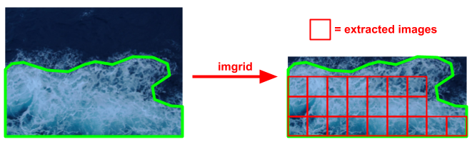

# imgrid
Tool for extracting gridified images from LabelMe JSON annotation format.



## Installation
* Requires Python>=3.7
* Install using pip: ```pip install imgrid```

## Usage
Use below command to use the tool:

```imgrid <json_dir> <out_dir> <width> <height> [--x_stride=<x_stride>] [--y_stride=<y_stride>] [--no_label] ```
* *json_dir* is the directory where the LabelMe JSON annotations are saved.
* *out_dir* is the directory where the extracted images will be saved.
* *width* is the width of each extracted image.
* *height* is the height of each extracted image.
* *x_stride* is the stride in horizontal direction while scanning through each shape. By default this is the same as *width*.
* *y_stride* is the stride in vertical direction while scanning through each shape. By default this is the same as *height*.
* Add *--no_label* if no label needs to be saved. If it is not added, a txt file containing the image class name will be saved along each extracted image.

The tool will ignore any non-area annotations in the LabelMe JSONs, i.e., it will only consider shape_type that is either *polygon*, *rectangle*, or *circle*.